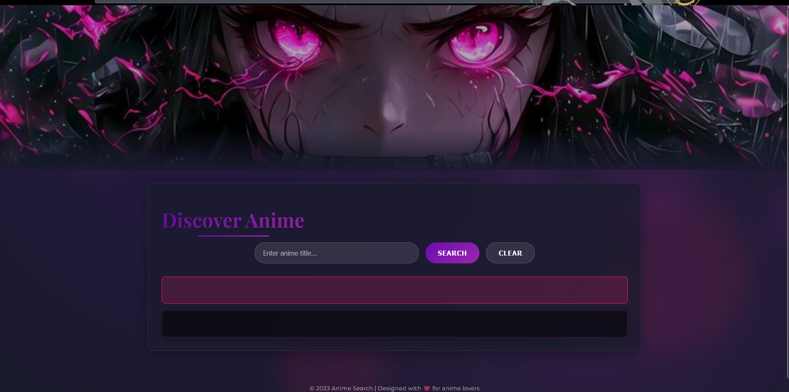

# Anime Search Application

A stylish and elegant anime search application that allows users to find information about their favorite anime shows with a beautiful UI design.

## ✨ Features 

- **Modern UI Design**: Elegant gradient colors and smooth animations
- **Responsive Layout**: Works on all device sizes
- **Anime Details**: Display comprehensive information about each anime
- **Error Handling**: User-friendly error messages
- **Interactive Elements**: Hover effects and transitions
- **Floating Background Elements**: Dynamic decorative elements

## 🛠️ Technologies Used 

- HTML5
- CSS3 (with modern features like backdrop-filter)
- JavaScript
- jQuery
- Google Fonts (Montserrat & Playfair Display)

## 🎨 Design Elements 

- **Color Scheme**:
  - Primary: #6a0dad (Purple)
  - Secondary: #9c27b0 (Light Purple)
  - Accent: #e91e63 (Pink)
  
- **Typography**:
  - Headings: Playfair Display (Elegant serif)
  - Body: Montserrat (Clean sans-serif)

## 💻 Installation 

No installation required! Just open the `index.html` file in your browser.

## 🚀 Usage 

1. Enter an anime title in the search box
2. Click "Search" button
3. View detailed information about the anime
4. Use "Clear" button to reset the search

##  🛠 Customization 

You can easily customize:

- Colors in the `:root` CSS variables
- Fonts by changing the Google Fonts import
- Animation speeds in the CSS
- Floating elements behavior in the JavaScript

## 🤝 Contributing 

Contributions are welcome! Please follow these steps:

1. Fork the project
2. Create your feature branch (`git checkout -b feature/AmazingFeature`)
3. Commit your changes (`git commit -m 'Add some AmazingFeature'`)
4. Push to the branch (`git push origin feature/AmazingFeature`)
5. Open a Pull Request

## License 📜

This project is licensed under the MIT License - see the [LICENSE.md](LICENSE.md) file for details.

## Credits 🙏

- Anime data provided by [Jikan API](https://jikan.moe/) (Unofficial MyAnimeList API)
- Inspiration from various anime streaming platforms

---

Made with ❤️ by [EngllNouf](https://github.com/EngllNouf)
